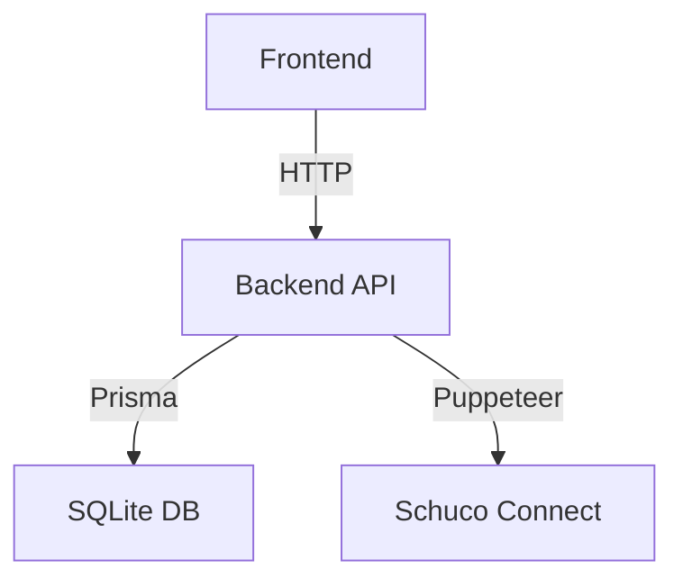

# Dokumentacja - Pozostałe Zadania (Fazy 4-8)

**Status:** ✅ Fazy 1-3 ZAKOŃCZONE
**Data utworzenia:** 2025-12-30
**Priorytet:** ŚREDNI/NISKI (fundamenty już są)

---

## ✅ Zakończone (Fazy 1-3)

- [x] Faza 1: Czyszczenie i archiwizacja
- [x] Faza 2: Kluczowe dokumenty (README, ARCHITECTURE, CONTRIBUTING, QUICK_START)
- [x] Faza 3: Przeniesienie i organizacja plików

**Rezultat:** Redukcja plików w root/ z 57 do 11 (-81%)

---

## 📋 Do Zrobienia

### 🔴 FAZA 5: User Guides (Priorytet: WYSOKI)

**Czas:** 6-8h
**Lokalizacja:** `docs/user-guides/`

Utworzyć przewodniki dla użytkowników końcowych:

- [ ] `getting-started.md` - Pierwsze kroki w systemie
- [ ] `orders.md` - Jak tworzyć i zarządzać zleceniami
- [ ] `deliveries.md` - Jak planować dostawy, kalendarze
- [ ] `warehouse.md` - Jak zarządzać magazynem profili
- [ ] `imports.md` - Jak importować pliki CSV/PDF
- [ ] `reports.md` - Jak generować raporty i eksporty
- [ ] `faq.md` - Najczęściej zadawane pytania
- [ ] `troubleshooting.md` - Typowe problemy i rozwiązania

**Template dla każdego guide:**
```markdown
# [Feature Name] - Przewodnik Użytkownika

## Co to jest?
[Wyjaśnienie dla użytkownika biznesowego]

## Jak używać?
### Krok 1: ...
### Krok 2: ...

## Typowe scenariusze
### Scenariusz A: ...
### Scenariusz B: ...

## FAQ
**Q: ...**
A: ...

## Rozwiązywanie problemów
Problem: ...
Rozwiązanie: ...
```

---

### 🟠 FAZA 4: Dokumentacja Features (Priorytet: ŚREDNI)

**Czas:** 8-10h
**Lokalizacja:** `docs/features/`

Utworzyć dokumentację dla każdego głównego modułu:

#### Orders Module
- [ ] `docs/features/orders/overview.md` - Przegląd modułu
- [ ] `docs/features/orders/workflow.md` - Workflow zleceń
- [ ] `docs/features/orders/api.md` - API endpoints
- [ ] `docs/features/orders/variants.md` - System wariantów

#### Warehouse Module
- [ ] `docs/features/warehouse/overview.md` - Przegląd modułu
- [ ] `docs/features/warehouse/stock-management.md` - Zarządzanie stanem
- [ ] `docs/features/warehouse/monthly-remanent.md` - Remanent miesięczny
- [ ] `docs/features/warehouse/operations.md` - Operacje magazynowe

#### Glass Module
- [ ] `docs/features/glass/orders.md` - Zamówienia szyb
- [ ] `docs/features/glass/deliveries.md` - Dostawy szyb
- [ ] `docs/features/glass/validations.md` - Walidacje

#### Deliveries Module (rozszerzyć istniejący)
- [ ] `docs/features/deliveries/calendar.md` - Integracja z kalendarzem
- [ ] `docs/features/deliveries/pallet-optimization.md` - Algorytm pakowania
- [ ] `docs/features/deliveries/protocols.md` - Protokoły dostawy PDF

**Template:**
```markdown
# [Feature Name]

## Overview
[Technical overview]

## Architecture
[Diagram + opis]

## API Endpoints
### GET /api/...
### POST /api/...

## Database Schema
[Prisma models]

## Business Logic
[Service layer details]

## Frontend Integration
[React Query hooks, components]

## Testing
[Test strategy]
```

---

### 🟠 FAZA 6: API Documentation (Priorytet: ŚREDNI)

**Czas:** 4-6h
**Lokalizacja:** `docs/api/`

Utworzyć katalog i rozszerzyć dokumentację API:

- [ ] `docs/api/README.md` - Overview + link do Swagger
- [ ] `docs/api/endpoints.md` - Pełna lista endpointów z opisami
- [ ] `docs/api/authentication.md` - JWT auth details
- [ ] `docs/api/rate-limiting.md` - Rate limiting strategy
- [ ] `docs/api/websockets.md` - WebSocket endpoints
- [ ] `docs/api/error-codes.md` - Katalog błędów

**Bazować na:** `docs/API_DOCUMENTATION.md` (przenieść + rozszerzyć)

---

### 🟠 FAZA 7: Frontend Documentation (Priorytet: ŚREDNI)

**Czas:** 4-6h
**Lokalizacja:** `docs/frontend/`

Utworzyć katalog i rozszerzyć dokumentację Frontend:

- [ ] `docs/frontend/README.md` - Overview
- [ ] `docs/frontend/routing.md` - Next.js App Router specifics
- [ ] `docs/frontend/state-management.md` - React Query patterns
- [ ] `docs/frontend/components.md` - Component library (Shadcn/ui)
- [ ] `docs/frontend/forms.md` - React Hook Form + Zod
- [ ] `docs/frontend/styling.md` - TailwindCSS conventions

**Bazować na:** `docs/FRONTEND_DOCUMENTATION.md` (przenieść + rozszerzyć)

---

### 🟢 FAZA 8: Finalizacja (Priorytet: NISKI)

**Czas:** 2-3h

#### 8.1 Aktualizacja README indeksów
- [ ] `docs/README.md` - zaktualizować indeks z nowymi katalogami
- [ ] `.plan/README.md` - utworzyć wyjaśnienie struktury
- [ ] `.claude/README.md` - instrukcja używania Claude
- [ ] `docs/guides/README.md` - indeks przewodników
- [ ] `docs/features/README.md` - indeks features

#### 8.2 Diagramy (Mermaid)
- [ ] Architecture diagram w ARCHITECTURE.md
- [ ] Database schema diagram
- [ ] Feature flow diagrams (Orders, Deliveries)
- [ ] Deployment diagram

**Przykład Mermaid:**


#### 8.3 Cross-linking
- [ ] Dodać "See also" sekcje w dokumentach
- [ ] Breadcrumbs w subkatalogach
- [ ] Linki między powiązanymi dokumentami

#### 8.4 .gitignore update
```gitignore
# Playwright artifacts
apps/web/playwright-report/
apps/web/test-results/

# Claude Code cache
.claude/hooks-cache/
.claude/tsc-cache/
```

---

## Estymacja Czasu

| Faza | Priorytet | Czas | Status |
|------|-----------|------|--------|
| 1 | 🔴 WYSOKI | 2-3h | ✅ DONE |
| 2 | 🔴 KRYTYCZNY | 4-6h | ✅ DONE |
| 3 | 🟠 ŚREDNI | 3-4h | ✅ DONE |
| **4** | 🟠 ŚREDNI | 8-10h | ⏳ TODO |
| **5** | 🔴 WYSOKI | 6-8h | ⏳ TODO |
| **6** | 🟠 ŚREDNI | 4-6h | ⏳ TODO |
| **7** | 🟠 ŚREDNI | 4-6h | ⏳ TODO |
| **8** | 🟢 NISKI | 2-3h | ⏳ TODO |

**Pozostało:** ~30-40h pracy

---

## Rekomendacje Wdrożenia

### Opcja A: Pełne Wdrożenie (30-40h)
Zrobić wszystkie fazy 4-8 dla kompletnej, profesjonalnej dokumentacji.

**Korzyści:**
- Kompletna dokumentacja user-facing
- Pełna dokumentacja techniczna
- Łatwiejsze onboarding użytkowników
- Mniej pytań do supportu

### Opcja B: Tylko User Guides (Faza 5, 6-8h)
Skupić się na dokumentacji dla użytkowników końcowych.

**Korzyści:**
- Największy impact dla użytkowników
- Mniej pytań "jak zrobić X?"
- Quick win

**Pomiń:**
- Techniczne features docs (są w kodzie)
- Rozszerzenia API/Frontend (są podstawy)

### Opcja C: Inkrementalna (1-2h/tydzień)
Dodawać dokumentację stopniowo, feature po feature.

**Korzyści:**
- Brak "big bang" refactoringu
- Dokumentacja rośnie organicznie
- Mniejszy effort na raz

---

## Jak Rozpocząć?

### Dla Fazy 5 (User Guides):

1. **Wybierz pierwszy guide:** `getting-started.md`
2. **Utwórz z template powyżej**
3. **Wypełnij sekcje:** screenshots, kroki, FAQ
4. **Review z użytkownikiem końcowym**
5. **Iteruj i popraw**

### Dla Fazy 4 (Features):

1. **Wybierz moduł:** Orders (najprostszy start)
2. **Czytaj kod:** routes → handlers → services
3. **Rysuj diagram:** architecture flow
4. **Dokumentuj API:** endpoints, payloads
5. **Opisz workflow:** business logic

---

## Priorytetyzacja

**Jeśli masz tylko 8h:**
→ Zrób Fazę 5 (User Guides) - biggest impact

**Jeśli masz 16h:**
→ Faza 5 (User Guides) + Faza 4 (Orders + Deliveries docs)

**Jeśli masz 30h:**
→ Wszystkie fazy 4-8 dla kompletnej dokumentacji

---

## Metryki Sukcesu

Po zakończeniu Faz 4-8:

- [ ] 100% modułów ma dokumentację
- [ ] User guides dla wszystkich features
- [ ] Mniej niż 5 pytań/tydzień o "jak zrobić X"
- [ ] Nowi użytkownicy onboarding < 30 min
- [ ] Deweloperzy znajdują odpowiedzi w docs

---

## Related

- [DOKUMENTACJA_AUDIT_RAPORT.md](../docs/DOKUMENTACJA_AUDIT_RAPORT.md) - Pełny audit
- [DOKUMENTACJA_REFAKTORYZACJA_SUMMARY.md](../docs/DOKUMENTACJA_REFAKTORYZACJA_SUMMARY.md) - Podsumowanie Faz 1-3

---

**Status:** 📋 BACKLOG
**Owner:** TBD
**Priority:** MEDIUM (fundamenty już są, to nice-to-have)

---

*Ostatnia aktualizacja: 2025-12-30*
