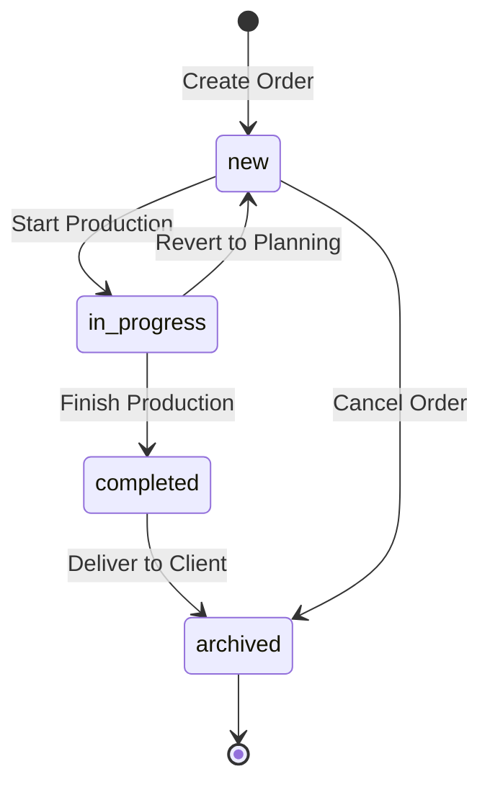
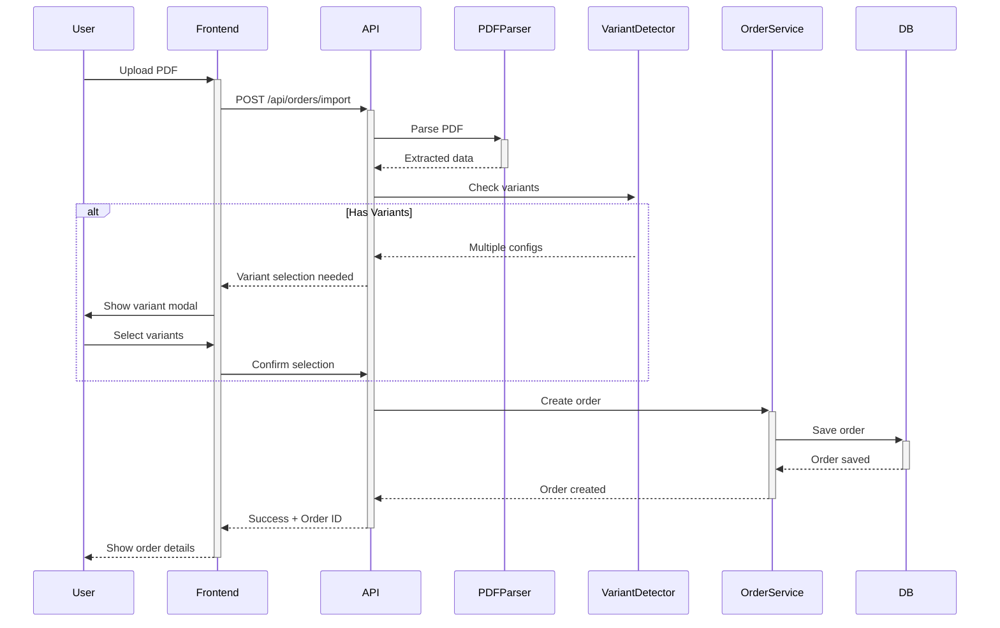

# Orders Module - Workflow

Detailed workflow documentation for order lifecycle management.

## Order Lifecycle States

## Creating an Order

### Manual Creation

1. User fills form with order data
2. System validates input (Zod schema)
3. Order created with status `new`
4. Requirements auto-calculated
5. Response with order ID

### PDF Import

## Updating an Order

### Status Changes

**new → in_production:**
- Triggered by: User action or auto on delivery assignment
- Side effects: Stock reservation, requirement calculation

**in_progress → completed:**
- Triggered by: Production finish confirmation
- Side effects: Stock consumed, ready for delivery

**completed → archived:**
- Triggered by: Delivery marked as delivered
- Side effects: Final archival, read-only mode

### Data Updates

**Allowed changes by status:**
| Field | new | in_progress | completed | archived |
|-------|-----|-------------|-----------|----------|
| Client details | ✅ | ✅ | ❌ | ❌ |
| Windows | ✅ | ⚠️ Limited | ❌ | ❌ |
| Delivery assignment | ✅ | ✅ | ✅ | ❌ |
| Status | ✅ | ✅ | ✅ | ❌ |

## Variant Workflow

### Detection

During PDF import, system detects variants if:
- Same window position has multiple configurations
- Different colors/profiles for same item
- Multiple price points

### User Selection

1. System presents all detected variants
2. User sees comparison table
3. User selects preferred variant(s)
4. Options:
   - Accept all variants (multiple orders)
   - Accept only selected (single order)
   - Reject import

### Switching Variants

After order creation:
1. User opens order details
2. Clicks "Variants" tab
3. Views all variants
4. Activates different variant
5. System updates order data
6. Requirements recalculated

---

*Last updated: 2025-12-30*
